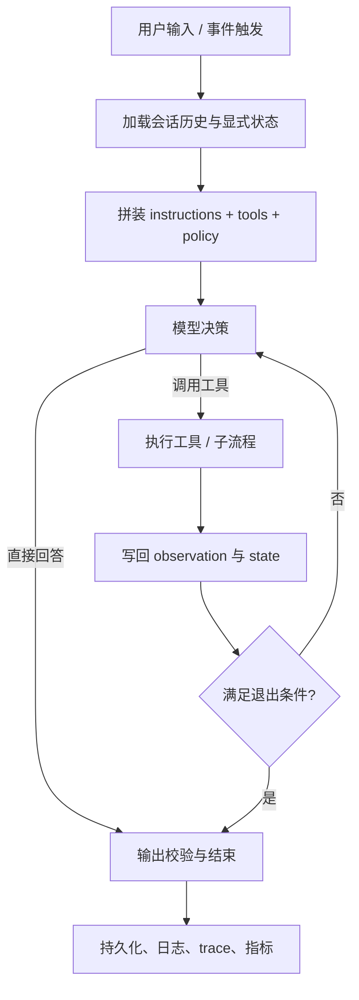

# Agent 架构与执行循环

## 本章目标

-   搞清单 Agent 的运行主干。
    
-   理解 manager、handoff、图结构这些常见编排形式。
    
-   建立“如何画出一个可实现 Agent 架构”的能力。
    

## 核心问题

-   一个 Agent run 从输入到结束到底经历了什么？
    
-   单 Agent 和多 Agent 的执行循环有什么共性？
    
-   什么时候该用 manager，什么时候该用 handoff？
    

## 正文

### 1\. 单 Agent 的标准执行路径

一个生产可用的单 Agent，通常至少包含下面这些部件：

-   输入标准化
    
-   指令拼装
    
-   历史/状态加载
    
-   模型决策
    
-   工具调用
    
-   结果回写
    
-   守护与校验
    
-   终止判断
    
-   持久化和追踪
    

可以用下面这张 Mermaid 图快速记忆：



### 2\. 伪代码：最小 Agent loop

```python
state = load_state(run_id)
history = load_history(session_id)

while True:
    model_input = build_input(history, state, tools, policy)
    decision = llm(model_input)

    if decision.type == "final":
        output = validate_output(decision.output)
        persist(output, state, history)
        return output

    if decision.type == "tool_call":
        result = execute_tool(decision.tool_name, decision.args)
        state = update_state(state, result)
        history = append_observation(history, result)
        continue
```

这个伪代码故意很朴素，但已经揭示了 Agent 的关键性质：

-   它不是一次函数调用，而是一个运行循环。
    
-   工具结果会反向影响下一轮决策。
    
-   状态和历史会持续演化。
    

### 3\. 退出条件为什么重要

OpenAI 的公开指南把“run 是一个循环，直到某个 exit condition 触发”为核心概念。常见退出条件有：

-   模型直接给出最终结果
    
-   触发某个 final-output 结构
    
-   达到最大轮数
    
-   命中错误阈值
    
-   进入人工审批
    
-   遇到不可恢复异常
    

很多失败的 Agent 系统，不是因为不会调用工具，而是因为没有清晰的退出条件，最终表现为：

-   死循环
    
-   无意义重复工具调用
    
-   一直“思考”但不提交结果
    
-   在低价值步骤里消耗大量 token
    

### 4\. 单 Agent 为什么往往是默认起点

OpenAI 在《A practical guide to building agents》中建议先最大化单 Agent 的能力，再考虑拆多 Agent。这条建议很值得背后的原因：

-   单 Agent 更容易评测。
    
-   状态更容易集中管理。
    
-   trace 更短，问题定位更快。
    
-   不会过早引入路由、handoff、共享记忆这些复杂度。
    

只有当下面情况出现时，拆分才更合理：

-   prompt 太复杂，逻辑过载
    
-   工具太多且相似，模型经常选错
    
-   任务边界天然分层，如 triage、research、execute、review
    
-   不同子任务需要不同安全策略或不同模型
    

### 5\. 多 Agent 的两种主流架构

根据 OpenAI 的公开资料，可以把多 Agent 常见形式压缩成两类。

#### 5.1 Manager 模式

中心 Agent 保持控制权，把其他 Agent 当工具。

特点：

-   用户只和 manager 打交道
    
-   manager 负责拆任务、调子 Agent、汇总结果
    
-   上下文和体验更统一
    

适合：

-   需要统一对外输出
    
-   需要中心化调度和汇总
    
-   子任务清晰但用户会话不想被切走
    

#### 5.2 Handoff 模式

一个 Agent 把控制权交给另一个 Agent，后者接手当前上下文继续执行。

特点：

-   更像“转接”
    
-   适合不同专业域轮流接管任务
    
-   原始 Agent 不一定继续保留控制权
    

适合：

-   路由型场景
    
-   不同 Agent 面向不同业务域
    
-   希望接手者直接与用户或系统后续步骤交互
    

### 6\. Manager 与 Handoff 的对比

| 维度  | Manager | Handoff |
| --- | --- | --- |
| 控制权 | 集中在 manager | 在 Agent 间转移 |
| 用户体验 | 更统一 | 更像转接 |
| 状态管理 | 中央汇总更容易 | 分散接力更复杂 |
| 调试难度 | 相对低 | 相对高 |
| 适用场景 | 任务编排、汇总、监督 | 路由分发、专业接管 |

一个很实用的经验：

-   需要“总控、汇总、兜底”时，优先 manager。
    
-   需要“谁最懂谁接手”时，考虑 handoff。
    

### 7\. 图结构视角

OpenAI 的资料提到，多 Agent 系统可以看作图：

-   节点是 Agent 或步骤
    
-   边是 tool call、handoff 或确定性控制流
    

从图结构看，Agent 系统通常包含三类节点：

-   决策节点：由模型决定下一步
    
-   执行节点：工具调用或业务动作
    
-   守护节点：评测、校验、审批、风控
    

从这个角度看，设计时就更容易问出关键问题：

-   哪些边是确定的？
    
-   哪些边让模型决定？
    
-   哪些节点会产生副作用？
    
-   哪些节点必须可恢复？
    

### 8\. 长时运行与可恢复执行

当 Agent 任务变长，比如：

-   调代码仓库修复 bug
    
-   多文档研究与汇总
    
-   外部审批串联
    
-   人工确认后继续执行
    

你就不能只靠“把所有历史都塞回 prompt”来维持系统。LangGraph 的官方文档把 durable execution、human-in-the-loop、stateful workflow 放在核心位置，就是因为真实 Agent 经常不是一次 run 就结束。

长时运行意味着你必须考虑：

-   checkpoint 放在哪
    
-   中断后如何恢复
    
-   副作用是否可重放
    
-   哪些动作必须幂等
    

## 工程细节与取舍

### 1\. History 和 State 最好分开存

历史消息适合解释“发生过什么”，显式 state 适合表达“现在进展到哪”。混在一起会让恢复和调试都变得困难。

### 2\. 工具执行层不要完全相信模型

模型可能生成错误参数、越权动作、缺失字段。工程上通常需要：

-   schema 校验
    
-   权限校验
    
-   审批节点
    
-   幂等键
    
-   重试策略
    

### 3\. Agent loop 要有硬边界

至少建议配置：

-   最大轮数
    
-   最大工具调用次数
    
-   最大累计成本
    
-   连续失败阈值
    

### 4\. Handoff 会放大上下文污染问题

当多个 Agent 共享长上下文时，错误结论、注入内容、噪声状态都可能被继续传递，所以 handoff 之间最好做结构化压缩，而不是原样转发所有自然语言历史。

## 常见误区

### 误区 1：多 Agent 就是并行

不对。多 Agent 可以串行、并行，也可以是中心调度加局部并行。核心在职责拆分，不在于是否同时运行。

### 误区 2：把 Agent 画成图就等于设计完成

不对。图只说明控制流，没说明状态格式、错误恢复、工具权限、审计链路。

### 误区 3：工具调用失败后让模型自己想办法就行

不对。很多失败不是“智力问题”，而是外部系统约束问题，必须由运行时明确告诉模型失败类型，并给出可恢复动作。

## 面试与实战问答

### 问：Agent 的 run loop 是什么？

短答： 就是模型在一次任务里持续读取上下文、决定动作、执行工具、接收观察并循环，直到退出条件成立。

深答： 没有 loop，系统通常只能完成一次性生成；有了 loop，才有真正的多步执行和动态调整。

### 问：manager 和 handoff 有什么区别？

短答： manager 保持控制权，把其他 Agent 当工具；handoff 是直接把控制权移交出去。

深答： manager 更适合统一体验和集中治理，handoff 更适合路由接管和专业域分工。

### 问：为什么 Agent 系统需要 durable execution？

短答： 因为任务可能跨多步、多工具、多人审批甚至跨进程，必须能恢复。

深答： 一旦任务里存在文件写入、API 调用、人工中断和长时等待，单纯靠内存中的会话上下文是远远不够的。