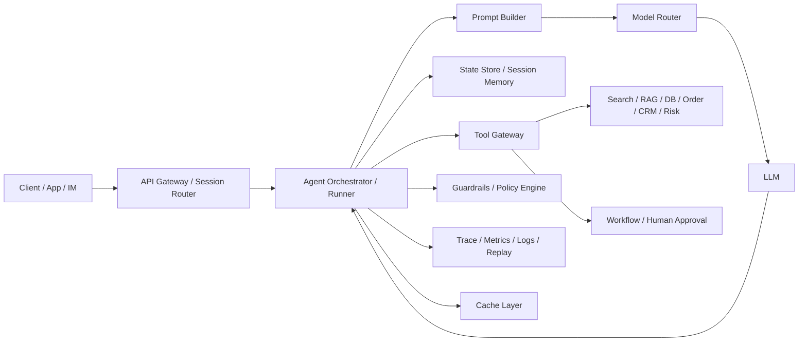

# 系统架构、执行闭环与多 Agent

## 本章目标

-   回答生产级 Agent 架构怎么画、怎么跑、怎么控。
    
-   建立规划、执行、反思、状态机、权限审批、多 Agent 拆分的统一视角。
    
-   让答案从“概念正确”升级到“可落地实施”。
    

## 关键问题

-   生产级 Agent 的核心组件有哪些？
    
-   规划、执行、反思为什么不能只靠 prompt？
    
-   单 Agent、多 Agent、workflow 分别怎么选？
    

## Q1：设计一个生产级的 AI Agent 系统架构，画出核心组件并说明数据流转

### 一句话回答

生产级 Agent 架构一般要把 `接入层、编排层、模型层、工具层、状态/记忆层、治理层、观测层` 分开，让“模型负责决策、系统负责约束和恢复”。

### 详细展开

可以按下面这张图来讲：

核心组件至少包括：

-   `API Gateway / Session Router`：鉴权、限流、租户识别、session 路由。
    
-   `Agent Orchestrator / Runner`：维护 loop、状态机、终止条件、超时、重试。
    
-   `Prompt Builder`：组装 system、developer、user、memory、retrieval、tool schema。
    
-   `Model Router`：按任务类型、成本和延迟要求选模型。
    
-   `Tool Gateway`：统一暴露工具，做 schema 校验、超时、审计、幂等。
    
-   `State Store / Memory`：显式状态、短期会话记忆、长期 profile、摘要。
    
-   `Policy / Guardrails`：权限、审批、敏感词、结构化输出校验、风控。
    
-   `Observability`：trace、metrics、logs、replay、eval 数据沉淀。
    

数据流一般是：

1.  用户请求进入网关，完成鉴权、限流、session 绑定。
    
2.  Orchestrator 读取显式状态、会话摘要、用户画像和必要的知识检索结果。
    
3.  Prompt Builder 构造本轮输入，并把工具 schema 注入模型上下文。
    
4.  模型先做决策：直接答复、调用工具、请求人工、handoff 或结束。
    
5.  若模型调用工具，Tool Gateway 执行真实操作，并把结果标准化回写。
    
6.  Orchestrator 更新状态、记录 trace，并判断是否进入下一轮。
    
7.  输出前经过 guardrails、格式校验与敏感内容检查，再返回客户端。
    

### 落地要点

-   不要把所有控制逻辑都塞进 prompt，状态机、超时、审批、幂等必须放运行时。
    
-   工具层要统一封装，不要让模型直接访问内部系统。
    
-   记忆和状态最好分开存；历史用于解释，状态用于控制。
    
-   Trace 和 replay 要从 Day 1 建，不然线上根本无法排查。
    

## Q2：Agent 的“规划-执行-反思”闭环如何实现

### 一句话回答

“规划-执行-反思”不是三段文案，而是一个可回写状态的闭环：先产生计划，再按步骤执行，再对结果做校验或修正，并决定是否继续循环。

### 详细展开

一个稳妥实现是把它拆成三个可观测阶段：

-   `Plan`：输出目标拆解、子任务顺序、依赖关系、退出条件。
    
-   `Act`：调用工具、访问知识、写回中间结果。
    
-   `Reflect`：检查是否偏题、是否缺关键信息、是否违反约束、是否已经完成。
    

工程上建议把反思做成显式节点，而不是完全依赖模型“自己想一想”。常见方法有：

-   执行若干步后强制进入 evaluator 节点。
    
-   每次工具调用失败后进入反思分支。
    
-   当成本、轮数、置信度达到阈值时触发反思或人工接管。
    

一个常见循环是：

1.  先生成高层计划，只保留 3 到 7 个阶段，不要一次性规划过细。
    
2.  每轮只执行一个或少数几个确定动作。
    
3.  把工具结果、错误码、置信度写回状态。
    
4.  反思节点检查“目标是否变化、计划是否失效、是否应终止”。
    
5.  若不满足退出条件，则重新规划局部，而不是整份大计划全部重写。
    

### 落地要点

-   反思最好有固定检查维度：正确性、完整性、安全性、成本。
    
-   计划不要太长，越长越容易建立在错误前提上。
    
-   反思结果尽量结构化，如 `continue / replan / ask_human / finalize`。
    
-   对高风险动作，反思节点后面可以接审批节点。
    

## Q13：如何设计 Agent 的状态机与退出条件，避免死循环

### 一句话回答

不要把 Agent 当“会一直思考的黑箱”，而要把它设计成显式状态机，并配置最大轮数、最大工具调用次数、最大成本和人工接管条件。

### 详细展开

推荐把一次 run 设计成下面这些状态：

-   `RECEIVED`
    
-   `CONTEXT_LOADED`
    
-   `PLANNED`
    
-   `ACTING`
    
-   `WAITING_TOOL`
    
-   `REFLECTING`
    
-   `WAITING_HUMAN`
    
-   `FINALIZING`
    
-   `DONE / FAILED / ABORTED`
    

退出条件至少要包含：

-   输出满足 final schema
    
-   达到最大轮数
    
-   达到最大工具调用次数
    
-   连续失败达到阈值
    
-   成本超预算
    
-   命中风控或转人工
    

避免死循环的关键，不是让模型“更聪明”，而是让运行时能识别坏模式，例如：

-   连续调用同一个失败工具
    
-   多轮输出没有实质状态变化
    
-   一直重复检索类似结果
    
-   在非关键步骤上消耗了大量 token
    

### 落地要点

-   每轮执行后都写 `state diff`，没有 diff 的轮次要重点告警。
    
-   给工具调用记录 `tool_name + args_hash + result_status`，用于检测重复失败。
    
-   高风险任务要支持人工中止和强制结束。
    

## Q14：单 Agent 与多 Agent 的拆分边界怎么定

### 一句话回答

先把单 Agent 做强，只有当职责边界、权限边界、评测边界和上下文复杂度都清楚时，再拆多 Agent。

### 详细展开

是否拆多 Agent，建议看四个维度：

-   `职责边界`：是否天然分成路由、研究、执行、审核几类角色。
    
-   `工具边界`：不同任务是否依赖完全不同的工具集。
    
-   `风险边界`：只读能力和可写能力是否应该隔离。
    
-   `评测边界`：拆出来的子 Agent 能不能独立回放和评测。
    

适合继续单 Agent 的情况：

-   任务链不长
    
-   工具数不多
    
-   风险等级一致
    
-   prompt 还能稳定维护
    

适合拆多 Agent 的情况：

-   单个 prompt 已明显过载
    
-   工具太多且经常选错
    
-   不同任务的 SLA、权限、模型不一样
    
-   需要 manager 汇总多个专业结论
    

### 落地要点

-   多 Agent 的核心收益是复杂度隔离，不是“更智能”。
    
-   拆分后一定要有统一 trace，否则排障成本会暴涨。
    
-   子 Agent 之间的交接信息要结构化，不要整段自然语言硬传。
    

## Q15：Handoff 和 manager 模式分别适合什么场景

### 一句话回答

manager 是中心调度、集中治理；handoff 是控制权切换、专业域接管。

### 详细展开

`Manager` 模式下：

-   用户只面对一个总控 Agent。
    
-   总控 Agent 决定是否调用“研究 Agent”“下单 Agent”“审核 Agent”。
    
-   子 Agent 更像工具或 worker。
    

适合：

-   需要统一用户体验
    
-   需要中心化日志和权限收口
    
-   任务结果需要汇总后统一输出
    

`Handoff` 模式下：

-   一个 Agent 接手后，可以把主控制权移交给另一个 Agent。
    
-   更像客服转接或多技能坐席协同。
    

适合：

-   明显的专业域切换
    
-   接手者要长期持有上下文
    
-   不同阶段由不同 Agent 主导更自然
    

### 落地要点

-   manager 更容易做统一治理。
    
-   handoff 更灵活，但更容易上下文污染和状态不一致。
    
-   在淘天场景里，路由客服、售后、营销专家这类问题，常是 `router + handoff` 或 `manager + specialist` 的混合形态。
    

## Q16：工具调用是同步还是异步？哪些场景需要 human-in-the-loop

### 一句话回答

读操作、低延迟短任务偏同步；长耗时、高副作用、依赖审批的任务偏异步，并在关键节点引入 human-in-the-loop。

### 详细展开

适合同步工具调用的场景：

-   搜索、检索、只读查询
    
-   小型数据库查询
    
-   轻量规则判断
    
-   用户强依赖即时反馈的问答
    

适合异步的场景：

-   长时任务，如多文档研究、批量工单处理
    
-   需要外部系统回调的任务
    
-   运行时间超过用户可接受等待阈值
    
-   大量并行子任务
    

需要 human-in-the-loop 的场景：

-   大额退款、发券、改价、删数据
    
-   低置信度且高风险决策
    
-   合规、法律、敏感客诉结论
    
-   模型和规则结论冲突时
    

### 落地要点

-   异步任务要有 task id、进度状态、回调或订阅机制。
    
-   审批要有过期时间、责任人、审计日志和可回放证据。
    
-   人工接管时不要只传自然语言摘要，最好同时传状态快照和关键工具结果。
    

## Q17：如何设计高风险工具的权限模型与审批链路

### 一句话回答

高风险工具不能只靠 prompt 约束，必须做 `身份鉴权 + 工具分级 + 参数级校验 + 审批令牌 + 全链路审计`。

### 详细展开

可以把工具按风险分级：

-   `L1`：只读工具，如搜索、查订单、查规则
    
-   `L2`：低风险写工具，如建草稿、生成建议
    
-   `L3`：高风险写工具，如退款、发券、删记录、改配置
    

权限模型建议采用：

-   `RBAC`：角色能否调用某类工具
    
-   `ABAC`：结合租户、业务线、订单归属、金额区间等属性动态判定
    
-   `参数级限制`：比如退款金额上限、只能处理本人店铺订单
    

审批链路一般是：

1.  Agent 产出结构化 action proposal。
    
2.  Policy Engine 校验风险等级。
    
3.  命中高风险阈值则生成审批单。
    
4.  审批通过后签发一次性执行令牌。
    
5.  Tool Gateway 校验令牌后才真正执行。
    

### 落地要点

-   审批对象应是结构化动作，不是整段自然语言。
    
-   高风险工具默认 dry-run，先展示影响面再确认。
    
-   每次审批都要记录“谁批准了什么参数的什么动作”。
    

## Q32：为什么有些场景应该用 workflow，而不是 fully autonomous agent

### 一句话回答

如果路径高度确定、可枚举、合规要求强、成本和时延敏感，workflow 往往比 fully autonomous agent 更稳、更便宜、更容易审计。

### 详细展开

适合 workflow 的典型场景：

-   固定审批链
    
-   标准化表单处理
    
-   订单状态查询并模板化回复
    
-   规则明确的售后流程
    

不适合 fully autonomous 的原因：

-   没必要为固定流程引入额外自由度
    
-   更高的模型调用轮数和成本
    
-   更难定位问题归因
    
-   更难做严格审计和 SLA 保证
    

更合理的做法通常是“workflow + agent node”：

-   主流程由工作流保证确定性
    
-   局部复杂节点，如意图理解、异常解释、复杂摘要，由 Agent 接管
    

### 落地要点

-   能规则化的先规则化，把 Agent 放在真正需要动态决策的地方。
    
-   面试里说“我会优先评估是否真的需要 Agent”，通常比一上来全 Agent 更成熟。