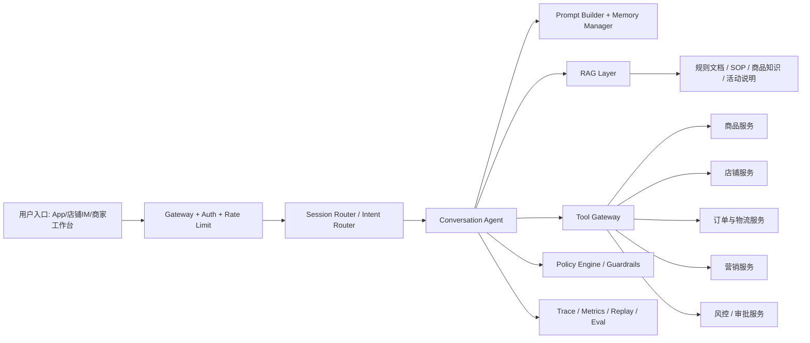

# 淘天场景综合设计题

## 本章目标

- 把前面所有问题压缩成一套完整的系统设计回答。
- 训练“先讲边界，再讲架构，再讲治理”的面试表达方式。
- 给出一个从 0 到 1 落地淘天客服/导购 Agent 的参考答案。

## 关键问题

- 如何把客服和导购统一到一个架构里？
- 什么时候用 Agent，什么时候退回 workflow？
- 如何兼顾业务效果、成本、安全和可运维性？

## Q50：如果让你从 0 到 1 落地一个淘天客服/导购 Agent，你的技术方案是什么？

### 一句话回答

我会采用“`统一接入层 + Router + 领域工具层 + RAG/实时事实双通路 + 风控审批 + 观测评测平台`”的架构，先从单 Agent 或 router + specialist 的受控方案起步，而不是一开始就 fully autonomous multi-agent。

### 一、先定义目标和边界

我会先把场景拆成两类：

- `导购类`：找商品、比商品、解释卖点、匹配需求、活动解读
- `客服类`：订单查询、物流问题、退款规则解释、售后工单协助

其中：

- 导购偏“推荐 + 检索 + 解释”
- 客服偏“事实查询 + 规则解释 + 动作提案”

高风险动作如退款、发券、改价、补偿，不直接让 Agent 最终执行，必须接审批或领域系统二次确认。

### 二、系统架构

### 三、我会怎么拆 Agent

初期我不会直接上很多 Agent，而是这样做：

- `Router`：识别导购、客服、售后、营销咨询等意图
- `ShoppingGuideAgent`：处理商品推荐、比较、活动说明
- `CustomerServiceAgent`：处理订单、物流、退款规则解释

如果后续复杂度上来，再增加：

- `PolicyAgent`：专门解释规则
- `ReviewAgent`：审核高风险输出

### 四、数据与知识双通路

我会明确区分两类信息源：

#### 1. 文档知识通路

适合：

- 售后规则
- 平台政策
- 活动说明
- 商品卖点说明

通过：

- 文档清洗
- 分层 chunk
- hybrid retrieval
- rerank

来供模型解释和回答。

#### 2. 实时事实通路

适合：

- 库存
- 价格
- 优惠
- 订单状态
- 物流状态

这些必须走结构化工具实时查询，不能主要依赖向量检索。

### 五、运行时设计

单次请求主链路：

1. 入口鉴权、识别租户和用户身份
2. 路由到导购或客服 Agent
3. 读取会话短期记忆和用户画像
4. 判断本轮需要文档检索、结构化查询还是两者都要
5. 调用模型决策下一步
6. 需要工具则调用领域工具
7. 回写状态并判断是否终止、澄清或转人工

显式状态里至少保存：

- 当前意图
- 已确认参数
- 已查询到的订单 / 商品 / 店铺主键
- 当前计划阶段
- 工具调用结果摘要
- 风控和审批状态

### 六、工具体系

建议工具分层：

- `只读事实工具`：查订单、查物流、查库存、查活动资格
- `解释性工具`：查规则、查知识库、查 FAQ
- `候选生成工具`：搜索商品、召回候选、获取推荐排序结果
- `高风险动作工具`：发券申请、退款申请、工单升级

高风险工具统一走：

- 参数校验
- 风险打分
- 审批令牌
- 执行审计

### 七、缓存与性能

我会设计四层缓存：

- retrieval cache
- tool result cache
- semantic answer cache
- feature/profile cache

并做这些优化：

- 常用只读查询缓存
- 多工具并行
- 高时延步骤异步化
- top-k 和 rerank 候选数动态调整
- 高频 FAQ 直接 workflow 化

### 八、安全与治理

重点防线：

- prompt injection 分区
- 工具最小权限
- 多租户隔离
- 敏感字段脱敏
- 高风险动作审批
- 全链路 trace
- 回放评测和灰度发布

### 九、监控与评测

我会重点看：

- 解决率
- 人工转接率
- 推荐点击率 / 转化率
- 客服场景一次解决率
- 平均轮数
- 工具成功率
- token 成本
- 高风险动作拦截率

评测集分成：

- 常规问题
- 模糊问题
- 实时事实问题
- 越权和攻击样本
- 工具故障样本

### 十、上线节奏

我会分三期做：

#### Phase 1：受控 MVP

- 单 Agent + 少量只读工具
- 只做导购问答和订单查询
- 高风险动作全部转人工

#### Phase 2：增强闭环

- 增加规则检索、会话记忆、结构化状态
- 接入工单升级和退款申请草稿
- 建立回放和评测平台

#### Phase 3：分角色协同

- 引入 router + specialist
- 对导购和客服做细粒度优化
- 用灰度和 A/B 做持续优化

### 面试加分点

- 先说“不盲目 fully autonomous”，说明你有工程克制。
- 明确区分“文档知识”和“实时事实”，说明你理解电商场景。
- 高风险动作走审批而不是直接执行，说明你有生产意识。
- 讲清 trace、评测、灰度、回滚，说明你是按上线标准在设计，而不是按 Demo 标准。
