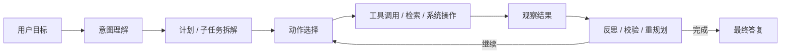

# AI Agent 基础、ChatBot 差异与执行模式

## 本章目标

-   先把“Agent 到底是什么”讲清楚，再区分 Agent、ChatBot、workflow、ReAct、planning 这些容易混淆的词。
    
-   建立一个统一口径：什么时候该用 Agent，什么时候不该用。
    

## 关键问题

-   Agent 比普通聊天机器人多了什么？
    
-   ReAct 和 planning 为什么是 Agent 的核心模式？
    
-   为什么很多场景更适合“workflow + 少量 Agent 节点”而不是完全自治？
    

## Q10：什么是 AI Agent？

### 一句话回答

AI Agent 是“以大模型为决策核心、能感知上下文、能调用工具、能分步执行任务并根据结果调整动作”的软件系统，而不只是一次问一次答的文本生成器。

### 详细展开

一个真正的 Agent 一般至少具备五个能力：

1.  `目标驱动`：输入不只是问题，还可能是一个任务目标，比如“帮我汇总本周工单并给出风险结论”。
    
2.  `状态持续`：它会在多轮中维护会话状态、任务状态或工作记忆。
    
3.  `动作能力`：它不只是生成文本，还能查知识、调接口、执行工具、写回结果。
    
4.  `反馈闭环`：它会根据工具结果判断下一步，而不是一次性把所有话说完。
    
5.  `可治理`：生产里的 Agent 必须受权限、预算、重试、超时、审计和人工审批约束。
    

所以 Agent 的本质不是“更会聊天”，而是“能在约束下完成任务”。

### 落地要点

-   把 Agent 看成 `LLM + 状态机 + 工具网关 + 记忆层 + 治理层`，不要把所有控制逻辑都塞进 prompt。
    
-   把“会不会调用工具”“是否允许继续循环”“是否需要人工接管”做成运行时逻辑，而不是让模型自由发挥。
    
-   生产里优先解决可控性，再追求自治性。
    

### 高频追问

-   Agent 一定要多轮吗？
    
    -   不一定，但只要出现“先观察再行动再校验”的闭环，它就比单轮问答更接近 Agent。
        
-   Agent 一定要有工具吗？
    
    -   不一定，但没有工具时它只能在文本空间里推理，很多现实任务就无法闭环。
        

## Q12：Agent 和普通 ChatBot 有什么区别？

### 一句话回答

普通 ChatBot 主要解决“对话生成”，Agent 主要解决“任务执行”。

### 详细展开

两者最关键的差异不在于模型大小，而在于系统设计目标：

| 维度  | 普通 ChatBot | AI Agent |
| --- | --- | --- |
| 核心目标 | 回答问题、陪聊、内容生成 | 完成任务、推进状态、调用外部能力 |
| 输入  | 当前问题为主 | 目标、约束、上下文、历史状态 |
| 输出  | 一段文本 | 文本 + 工具动作 + 状态变更 |
| 记忆  | 通常是会话上下文 | 会话记忆 + 任务状态 + 长期记忆 |
| 失败模式 | 答错、答非所问 | 死循环、错用工具、越权、状态不一致 |
| 治理重点 | 内容质量、风格 | 权限、预算、审计、幂等、回滚 |

面试时可以用一句话收束：`ChatBot 更像“会说话的接口”，Agent 更像“会决策的执行器”。`

### 落地要点

-   如果你的业务只有“问什么答什么”，不需要强行上 Agent。
    
-   如果需要跨多个系统查数、生成行动方案、执行动作或等待异步结果，才更适合 Agent。
    
-   很多所谓“Agent 产品”，本质上是“带一点工具调用的 ChatBot”，这在面试里要分清楚。
    

### 高频追问

-   ChatBot 能不能升级成 Agent？
    
    -   可以，通常路线是 `多轮上下文 -> 检索 -> 工具 -> 计划与状态机 -> 治理`。
        

## Q31：什么是 ReAct Agent？

### 一句话回答

ReAct Agent 是一种把 `Reasoning` 和 `Acting` 交替组织起来的 Agent 模式，即先思考、再行动、再观察、再继续推理。

### 详细展开

ReAct 的价值在于把“先想清楚再做”和“边做边修正”结合起来。典型循环是：

1.  `Thought`：当前应该做什么。
    
2.  `Action`：调用某个工具或执行某个步骤。
    
3.  `Observation`：拿到工具结果。
    
4.  再回到下一轮 `Thought`。
    

它和一次性长链路规划的区别是：ReAct 允许根据环境反馈不断修正，不要求一开始就把全局计划写对。

适合 ReAct 的场景：

-   外部信息不完整，需要边查边决策。
    
-   工具结果可能影响后续路径。
    
-   任务可以拆成较短的“思考-动作”迭代。
    

不适合 ReAct 的场景：

-   纯固定流程任务。
    
-   高风险写操作很多，但又没有严格审批。
    
-   超低延迟场景，因为循环次数会直接拉高时延和成本。
    

### 落地要点

-   生产里不要把 `Thought/Action/Observation` 直接原样暴露给前端。
    
-   应把 ReAct 包在显式状态机里，配置最大轮数、最大工具次数、预算和超时。
    
-   对同一工具重复失败要触发重规划或人工接管，不能无限循环。
    

### 高频追问

-   ReAct 一定优于 Planning 吗？
    
    -   不一定。ReAct 更灵活，Planning 更适合大任务分解；生产里经常是先粗规划，再用 ReAct 执行局部步骤。
        

## Q42：Agent 如何做任务规划（planning）？

### 一句话回答

Planning 的目标不是“生成一份很长的计划书”，而是把任务拆成可执行、可校验、可中断的子任务序列。

### 详细展开

一个可落地的 planning 一般包括五部分：

1.  `目标澄清`：最终要交付什么，成功标准是什么。
    
2.  `任务拆解`：拆成若干子步骤，并标出依赖关系。
    
3.  `资源映射`：每步需要什么工具、知识或权限。
    
4.  `校验点`：每完成几步就判断是否跑偏。
    
5.  `退出条件`：什么情况下结束、失败、降级或转人工。
    

常见规划方式：

-   `一次性高层计划`：先产出 3 到 7 步的粗计划，再逐步执行。
    
-   `滚动规划`：先只规划最近一两步，执行后再更新。
    
-   `层级规划`：先做任务树，再对关键分支细化。
    

在生产里，滚动规划通常比“超长大计划”更稳，因为真实环境变化太快，长计划很容易建在错误前提上。

### 落地要点

-   计划结果最好结构化，例如 `step_id / goal / required_tools / done_condition / risk_level`。
    
-   先做高层任务树，再对当前分支细化，避免一上来规划过深。
    
-   规划器和执行器可以是同一个模型，也可以分成两个组件；复杂场景更推荐分层。
    

### 高频追问

-   规划是否一定要用 LLM？
    
    -   不一定。固定路径可以规则化；只有当任务结构开放、路径不确定时，才需要模型参与规划。
        

## Q47：Agent workflow 和普通 workflow 有什么区别？

### 一句话回答

普通 workflow 的路径由开发者预先写死，Agent workflow 的路径允许由模型基于上下文动态决策。

### 详细展开

可以把它们理解成两种不同的控制权分配：

| 维度  | 普通 workflow | Agent workflow |
| --- | --- | --- |
| 路径决定者 | 开发者 | 开发者 + 模型 |
| 分支空间 | 可枚举、可预定义 | 部分开放、依赖上下文 |
| 稳定性 | 高   | 相对低 |
| 可审计性 | 强   | 需要额外 trace |
| 成本  | 可预测 | 容易抖动 |
| 适合场景 | 规则明确、合规强、SLA 严格 | 任务开放、需要动态判断 |

很多成熟系统并不是纯 Agent，而是：

`workflow 负责主干控制，Agent 负责局部不确定节点`

比如客服系统里：

-   路由、鉴权、审计、工单流转走 workflow。
    
-   意图识别、知识检索、异常解释、回复草拟由 Agent 负责。
    

### 落地要点

-   能规则化的先规则化，再把 Agent 放在真正需要动态决策的节点上。
    
-   普通 workflow 负责稳定性，Agent workflow 负责灵活性，两者不是替代关系。
    
-   面试里说“我会优先评估是否真的需要 Agent”，往往比一上来就全 Agent 更成熟。
    

### 高频追问

-   什么场景不适合 Agent workflow？
    
    -   高风险写操作、强合规审批链、极低延迟、固定表单型任务，都更适合普通 workflow。