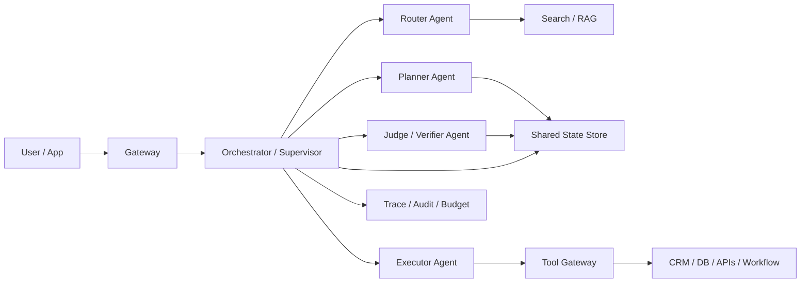

# 多 Agent、Memory 与上下文窗口

## 本章目标

- 回答多 Agent 怎么拆、怎么协作、怎么共享状态。
- 讲清楚 ChatMemory、长期记忆、对话历史、上下文窗口之间的关系。

## 关键问题

- 多 Agent 协作系统到底怎么设计，才能不乱、不慢、不失控？
- Memory 和 history 有什么区别？
- 上下文窗口不够时，是不是只能“换更大的模型”？

## Q1：如何实现多 Agent 协作系统？

### 一句话回答

多 Agent 协作系统的关键不是“多放几个模型”，而是把角色边界、共享状态、通信协议、权限和终止条件设计清楚。

### 详细展开

一个可落地的多 Agent 系统通常有四层：

1. `入口层`：网关、会话路由、鉴权、限流。
2. `编排层`：负责选择 Agent、保存任务状态、管理循环和退出条件。
3. `执行层`：各类专职 Agent，例如 router、planner、researcher、executor、reviewer。
4. `治理层`：权限、预算、超时、重试、审计、回放。

常见协作模式有三种：

- `Manager-Worker`：一个总控 Agent 调度多个专用 Agent。
- `Router-Handoff`：先路由到最合适的 Agent，再由该 Agent 持续接手。
- `Pipeline`：多个 Agent 按固定顺序接力，适合文档加工、代码审查、分析报告。

多 Agent 不是为了“更聪明”，而是为了把复杂性隔离开：

- 不同 Agent 负责不同职责。
- 不同 Agent 绑定不同工具集和权限。
- 不同 Agent 可以使用不同模型和预算。

### 落地要点

- Agent 之间传递的不是整段自然语言，而应尽量传 `structured handoff`，例如 `task`, `constraints`, `artifacts`, `confidence`, `next_action`。
- 需要有共享状态存储，至少记录 `task_id`、当前阶段、已调用工具、关键中间结果、预算消耗。
- 每个 Agent 都要有清晰退出条件，否则容易出现来回 handoff 或死循环。
- 只读 Agent 和可写 Agent 最好隔离，避免权限放大。

### 高频追问

- 什么时候不该拆多 Agent？
  - 当任务链短、工具少、角色边界不清、延迟预算紧时，单 Agent 更合适。

## Q21：什么是 ChatMemory？

### 一句话回答

ChatMemory 是“送给模型看的记忆”，不等于用户界面里看到的完整聊天记录。

### 详细展开

这是一个面试里很容易混淆的点：

- `History`：完整对话历史，强调真实性和可追溯。
- `Memory`：为当前推理服务的上下文压缩结果，强调有用性和成本控制。

比如 LangChain4j 官方文档就明确区分了 memory 和 history：history 保留原始消息，memory 是为了让模型“看起来记得住”，会做裁剪、摘要甚至注入额外信息。

ChatMemory 主要解决三个问题：

1. `上下文窗口有限`
2. `多轮成本不断上升`
3. `模型需要必要背景，但不需要所有历史细节`

### 落地要点

- 不要把 UI 历史直接当作模型记忆；两者要分别存储。
- Memory 要能按会话、用户、租户隔离，并支持 TTL。
- 会话摘要、用户画像、长期偏好都应视为 memory 的不同层，而不是一锅乱炖。

### 高频追问

- ChatMemory 放数据库还是缓存？
  - 热会话一般放 Redis / 内存，归档和审计放数据库 / 对象存储。

## Q24：Agent memory 有哪些类型？

### 一句话回答

Agent memory 通常可以分为工作记忆、会话记忆、长期记忆、语义记忆、情节记忆和工具记忆。

### 详细展开

下面这张表是比较实用的答法：

| 类型 | 存什么 | 生命周期 | 典型用途 | 常见实现 |
| --- | --- | --- | --- | --- |
| 工作记忆 | 当前步骤的中间变量 | 一个任务周期 | 当前工具结果、临时计划 | 内存对象、状态机上下文 |
| 会话记忆 | 最近多轮对话 | 一个会话 | 保持连续对话 | 消息窗口、token 窗口、摘要 |
| 长期记忆 | 用户长期偏好和档案 | 跨会话 | 个性化和复用 | KV、关系库、用户画像表 |
| 语义记忆 | 结构化知识与语义片段 | 长期 | 检索增强 | 向量库、知识库 |
| 情节记忆 | 历史事件和关键经历 | 长期 | “上次做过什么” | 事件日志、任务归档 |
| 工具记忆 | 某类工具的可用性和调用经验 | 长期或半长期 | 选工具和避坑 | tool catalog、成功率统计 |

面试里最好再补一句：`真正稳定的系统，通常不是一个 memory，而是分层 memory。`

### 落地要点

- 工作记忆要结构化，不能只靠一段“当前状态说明”。
- 会话记忆要可裁剪、可摘要、可重建。
- 长期记忆必须有隐私和合规边界，不能无限累积。

### 高频追问

- Agent 真的需要长期记忆吗？
  - 不是所有场景都要。客服、助理、个性化推荐更需要；一次性问答则未必。

## Q25：如何实现对话历史 memory？

### 一句话回答

实现对话历史 memory 的关键不是“全量保存”，而是做分层存储、窗口裁剪、摘要压缩和检索回灌。

### 详细展开

一个成熟实现通常分四层：

1. `原始消息层`：完整保存 user / assistant / tool 消息，服务审计和回放。
2. `短期窗口层`：保留最近 N 条消息或最近 N tokens，保证当前对话连贯。
3. `摘要层`：把旧消息压缩成结构化摘要，例如用户目标、限制条件、已做决定。
4. `可检索层`：把关键历史片段做 embedding，供“需要时再回灌”。

典型算法有：

- `Message window`：保留最近 N 条，简单但粗糙。
- `Token window`：按 token 控制，更贴近成本。
- `Summarize-then-replace`：旧消息先摘要，再替换。
- `Salience retrieval`：只在当前问题与旧历史相关时检索回灌。

### 落地要点

- 对话历史要有 message role、时间戳、trace_id、tool_call_id。
- 摘要最好结构化，至少包含：`user_goal`, `constraints`, `decisions`, `open_questions`, `facts`。
- 摘要必须能重算，否则一旦摘要污染，后续轮次会持续偏航。
- 高风险系统中，关键事实不要只存在 summary 里，要保留原始引用。

### 高频追问

- 什么时候触发摘要？
  - 常见触发器是 token 预算接近阈值、轮数过多、阶段切换、长时间挂起后恢复。

## Q48：大模型上下文窗口是什么？如何突破长度限制？

### 一句话回答

上下文窗口是模型单次请求能看到的 token 范围；突破它的核心不是“塞更多字”，而是做裁剪、压缩、检索和分阶段处理。

### 详细展开

上下文窗口影响三件事：

1. 模型一次能处理多少输入。
2. 请求的成本和延迟。
3. 多轮对话是否容易被旧内容挤爆。

常见“突破长度限制”的方法有：

- `裁剪`：只保留当前任务必需内容。
- `摘要`：把长上下文压成结构化摘要。
- `RAG`：把大部分知识放外部，需要时检索。
- `分段处理`：先 map，再 reduce。
- `分层记忆`：热信息留上下文，冷信息外存。
- `工具外化`：实时报表、数据库结果不要整表塞进 prompt，而是按需查询。

### 落地要点

- 不要把“更大上下文窗口”当作唯一方案，因为成本、延迟和注意力稀释都会上升。
- 先做 prompt budgeting，把 system、memory、retrieval、tool schema、user input 各自的 token 预算配出来。
- 模型越大，越要控制无效上下文，因为“能装下”不代表“会关注”。

### 高频追问

- RAG 和 memory 都是在解决上下文窗口问题吗？
  - 是，但侧重点不同。memory 处理“会话连续性”，RAG 处理“外部知识接入”。
