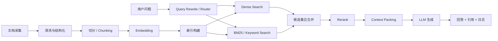

# RAG 原理、检索链路与知识工程

## 本章目标

- 把 RAG 从“加个向量库”讲成一条完整的数据链路。
- 讲清楚 embedding、chunk、hybrid search、rerank、评测和 latency 优化各自解决什么问题。

## 关键问题

- RAG 到底增强了什么？
- 为什么召回质量、切分策略、rerank 和 latency 要一起看？
- 如何把 RAG 做成可评估、可调优、可治理的系统？

## Q2：什么是 RAG（Retrieval Augmented Generation）？

### 一句话回答

RAG 是“先从外部知识中检索，再让模型基于检索结果生成答案”的模式，用来降低纯参数记忆的局限。

### 详细展开

纯 LLM 回答时，知识主要来自参数和当前 prompt；RAG 会在生成前接入外部知识，使模型不必只依赖训练时记住的内容。

RAG 的核心价值有三个：

1. `知识可更新`：知识库更新不必重新训练模型。
2. `答案可溯源`：可以返回引用片段。
3. `更适合私域知识`：企业内部文档、业务规则、产品资料都可以接入。

但要注意，RAG 不是“永远更准”：

- 检索错了，生成就会建立在错误证据上。
- 检索到了但上下文打包差，模型也可能答偏。
- 事实型问题适合 RAG，纯推理型问题未必需要。

### 落地要点

- RAG 的关键不只是向量库，而是完整链路：文档处理、召回、排序、上下文拼装、生成、评测。
- 最终目标不是“检索相似文本”，而是“给生成阶段提供正确且足够的证据”。

### 高频追问

- RAG 能完全消除幻觉吗？
  - 不能。它只能提升 grounding，生成阶段仍可能误读、拼接或过度推断。

## Q13：RAG latency 怎么优化？

### 一句话回答

优化 RAG latency 的核心是减少不必要的检索层级、缩短候选集规模、并行化链路并控制 prompt 体积。

### 详细展开

RAG 延迟大头通常来自四处：

1. query 改写或路由
2. 向量检索和关键词检索
3. rerank
4. 最终大模型生成

常见优化方法：

- `并行化`：dense search、BM25、metadata filter 并行执行。
- `动态检索`：简单问题少检索，复杂问题再上 hybrid 或 rerank。
- `缩候选`：rerank 只处理 top 20 到 top 100，不要把 top 500 全送进去。
- `缓存`：对热门 query、embedding、检索结果做分层缓存。
- `压缩 context`：只保留高证据片段，不要把整段长文都塞进去。
- `降低模型开销`：query rewrite 和 rerank 不一定非要用最贵模型。

### 落地要点

- 为每一层单独记时，至少拆成 `rewrite`, `retrieve`, `rerank`, `pack`, `generate`。
- 采用分级策略：
  - 快路径：keyword 或 dense 单路召回。
  - 慢路径：hybrid + rerank + 大模型。
- top-k 和 rerank 候选数要动态调，不要全场景固定。

### 高频追问

- latency 优化和质量会冲突吗？
  - 会，所以要做按场景分层，而不是单一配置打全场。

## Q15：RAG pipeline 的完整流程是什么？

### 一句话回答

完整 RAG pipeline 包含 `采集 -> 清洗 -> 切分 -> 向量化 -> 索引 -> 查询改写 -> 检索 -> 融合 -> 排序 -> 上下文打包 -> 生成 -> 评测与反馈`。

### 详细展开

把 RAG 分成离线和在线两条链看最清楚：

- `离线链`：负责把文档加工成可检索知识。
- `在线链`：负责把用户 query 变成答案。

离线链关注：

- 文档解析是否正确
- chunk 是否合理
- metadata 是否完整
- 索引是否可热更新

在线链关注：

- query 是否理解正确
- 检索是否覆盖关键证据
- 上下文是否压缩合理
- 回答是否引用充分、没有凭空补充

### 落地要点

- 不要把离线建库和在线问答混成一个黑盒。
- 每一层都要有独立日志和评测能力，这样才能知道问题是在切分、召回、排序还是生成。

### 高频追问

- query rewrite 算不算 RAG pipeline 一部分？
  - 算，而且在生产里常常非常重要，尤其是口语化、歧义多、短 query 场景。

## Q16：RAG 系统主要组件有哪些？

### 一句话回答

RAG 系统至少包括知识处理、索引存储、检索编排、排序、上下文组装、生成、缓存、监控和评测组件。

### 详细展开

一个比较完整的 RAG 系统可以拆成：

1. `Ingestion`：抓取、解析、清洗文档。
2. `Chunker`：按语义或结构切分。
3. `Embedding Service`：生成向量。
4. `Index / Store`：向量库、倒排索引、metadata 存储。
5. `Retriever`：dense、keyword、hybrid。
6. `Reranker`：重排序。
7. `Prompt Builder`：拼上下文、加入引用格式。
8. `Generator`：大模型生成回答。
9. `Observation & Eval`：记录 query、召回、答案、评分。

### 落地要点

- 元数据层很重要，很多过滤和治理都依赖它。
- 生成器不应该直接连文档源，而应通过可控检索链。
- RAG 系统需要版本化，尤其是 embedding 模型、切分策略、索引版本。

### 高频追问

- 向量库是不是 RAG 的核心？
  - 重要，但不是唯一核心；很多效果问题其实出在切分、排序和上下文拼装。

## Q18：RAG 如何做 rerank？

### 一句话回答

rerank 是在候选召回之后，再用更强的相关性模型对候选集做二次排序，以提升最终送给 LLM 的证据质量。

### 详细展开

常见做法是：

1. dense search / BM25 各召回一批候选。
2. 用 RRF 或加权合并得到候选集。
3. 用 cross-encoder 或 LLM-based rerank 对候选重新打分。
4. 只把 top n 片段送给生成模型。

rerank 解决的是“召回到了，但顺序不对”的问题。它尤其适合：

- query 很短
- 候选很多
- 需要高精度问答
- 同主题文档多、近义表达多

### 落地要点

- rerank 只适合小候选集，不要直接对全库 rerank。
- 评估 rerank 时看 nDCG、MRR、answer hit rate，比只看相似度更有意义。
- 如果 latency 很紧，可以对高价值 query 才开启 rerank。

### 高频追问

- rerank 能替代 hybrid search 吗？
  - 不能。rerank 只重排候选，前提是候选已经被召回到。

## Q20：embedding 和向量相似度搜索是什么？

### 一句话回答

embedding 是把文本映射到稠密向量空间；向量相似度搜索就是在这个空间里找“语义上更接近”的内容。

### 详细展开

embedding 模型会把一句话、一个 chunk、一个标题编码成固定维度向量。语义相近的文本通常在向量空间里距离更近。

常见相似度计算：

- 余弦相似度
- 点积
- 欧氏距离

向量搜索的优势是：

- 能处理同义表达
- 更适合口语化问题
- 不要求 query 和文档有完全相同关键词

它的局限也很明显：

- 对数字、型号、专有名词不一定稳定
- 精确词面匹配常常不如 BM25
- embedding 本身会受模型领域适配影响

### 落地要点

- 不要把向量检索当成万能方案，品牌词、SKU、错误码、法条编号等经常要靠关键词检索兜底。
- 文档向量和 query 向量要尽量使用匹配的 embedding 模型和预处理方式。

### 高频追问

- 向量越高维越好吗？
  - 不一定。更高维可能提高表达能力，但也增加存储、计算和索引成本。

## Q23：如何评估 RAG 系统效果？

### 一句话回答

评估 RAG 要拆成检索评测、答案评测和端到端业务指标三层，而不是只看用户觉得“像不像对的”。

### 详细展开

建议分三层评估：

1. `检索层`
  - Recall@K
  - Hit Rate
  - MRR
  - nDCG
2. `回答层`
  - faithfulness
  - answer correctness
  - citation precision
  - hallucination rate
3. `业务层`
  - 首答解决率
  - 人工转接率
  - 用户满意度
  - 平均响应时长

做评估时要把失败分型：

- 没召回到
- 召回到了但排太后
- 证据够了但生成没用好
- 回答对了但引用差

### 落地要点

- 一定要有标准 query 集和答案集，不能只靠线上拍脑袋。
- 评测样本要覆盖：事实问答、规则问答、多跳问答、时效性问答、歧义 query。
- 线上要保留 query、召回片段、最终回答、引用和人工判定，便于回放。

### 高频追问

- 可以用 LLM 当裁判吗？
  - 可以，但最好和人工标注、规则校验结合，避免单一裁判偏差。

## Q29：chunk size 为什么很重要？如何选择？

### 一句话回答

chunk size 决定了“证据粒度”和“噪声粒度”，过小容易语义不完整，过大容易把无关内容一起塞进去。

### 详细展开

选择 chunk size 本质是在平衡四件事：

1. 召回率
2. 片段纯度
3. 上下文成本
4. 回答所需证据跨度

经验上：

- FAQ、短知识卡片：小 chunk 更好。
- 规则文档、流程文档：保留标题层级和条款边界更重要。
- 技术文档、长报告：适合按章节或语义段落切分，再加适度 overlap。

### 落地要点

- 优先按结构切，再用 token 上限兜底。
- 常见 overlap 为 10% 到 20%，不是越大越好。
- 切分后要保留标题路径、文档 ID、段落位置、发布时间等元数据。

### 高频追问

- 是选 256、512 还是 1024 tokens？
  - 没有固定正确答案，必须结合你的 query 分布和评测集验证。

## Q30：如何实现 hybrid search（向量 + keyword）？

### 一句话回答

hybrid search 就是把语义召回和词面召回结合起来，再通过融合和 rerank 得到更稳的候选集合。

### 详细展开

为什么要 hybrid：

- 向量擅长语义相似
- BM25 擅长关键词、型号、数字、专有名词

一个常见实现是：

1. 同时跑 dense search 和 BM25。
2. 把候选去重。
3. 用加权得分或 RRF 融合。
4. 再 rerank。

### 落地要点

- 元数据过滤应在召回前完成，例如租户、语言、时间范围、文档状态。
- 不同 query 可以用不同融合权重，例如 SKU 查询偏关键词，口语问答偏语义。
- 线上要记录 dense 命中和 BM25 命中占比，方便后续调参。

### 高频追问

- hybrid search 会不会太慢？
  - 会，所以常用动态策略：低复杂 query 只走单路，高价值 query 再走双路。

## Q34：embedding 模型如何选择？

### 一句话回答

embedding 模型的选择标准不是排行榜名次，而是你的语种、领域术语、成本预算、延迟要求和检索评测结果。

### 详细展开

评估 embedding 模型时至少看五点：

- `语种支持`：中文、英文还是多语混合。
- `领域适配`：是否擅长代码、法律、医疗、电商、企业知识。
- `维度与成本`：更高维未必更划算。
- `在线延迟`：query embedding 延迟会影响整体 SLA。
- `迁移成本`：换模型通常意味着重建索引。

### 落地要点

- 先用通用高质量模型建立 baseline，再决定是否要上垂直领域模型。
- 评估时要用真实 query-doc 数据集，不要只看公开榜单。
- 版本升级要灰度双写或双索引对照，别直接切全量。

### 高频追问

- 文档 embedding 和 query embedding 可以不是一个模型吗？
  - 某些双塔系统可以，但大多数业务系统会优先保持一致，降低复杂度。

## Q36：文档切分有哪些策略？

### 一句话回答

文档切分常见策略有按固定长度切、按结构切、按语义切、按问题导向切，以及多策略混合切分。

### 详细展开

常见策略：

- `固定长度切分`：实现简单，但容易破坏语义边界。
- `按段落/标题结构切`：最实用，适合规章制度和技术文档。
- `按语义切分`：基于主题转折或模型判断，效果更好但成本更高。
- `按 QA / 卡片切分`：适合 FAQ、知识卡片、产品卖点。
- `父子块切分`：先存大块，检索后再回看子块或父块。

### 落地要点

- 对表格、列表、标题层级敏感的文档，不要只按字符数暴力切。
- 对代码、配置、日志，切分边界应按函数、类、模块或事件块。
- 最终目标是“让检索和生成都好用”，不是让 chunk 看起来整齐。

### 高频追问

- 一个系统里能混用多种切分吗？
  - 可以，而且通常应该混用，不同文档源不必共用一套切分策略。
