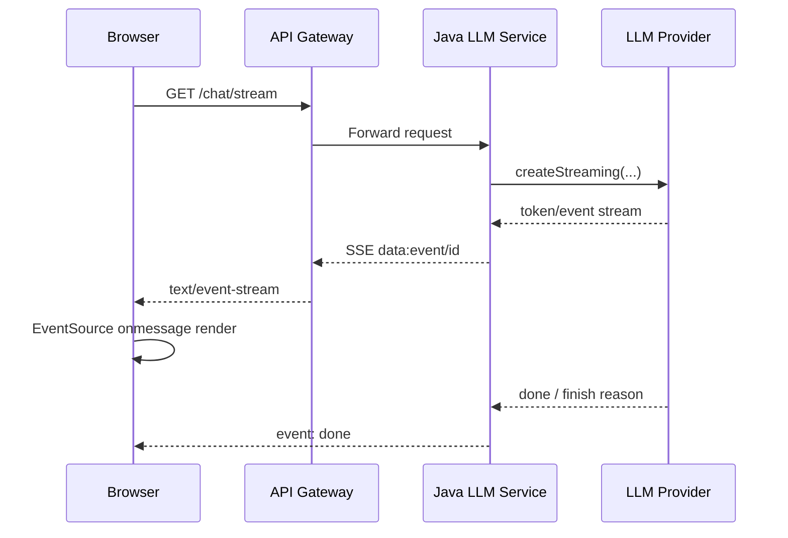

# Java LLM 服务工程：Streaming、SSE、缓存与性能

## 本章目标

- 回答 Java 服务里最常见的 LLM 工程问题：流式输出、SSE、缓存、连接池、限流和 latency 优化。
- 把“能跑通 demo”升级成“能上生产”的服务设计。

## 关键问题

- Java 端如何把上游模型流稳定地推给前端？
- SSE 和 WebSocket、普通 HTTP 响应各适合什么场景？
- LLM 服务为什么很容易被连接池、限流、长尾请求和无效上下文拖垮？



| 缓存层 | Key 例子 | Value | TTL | 风险 |
| --- | --- | --- | --- | --- |
| Prompt 模板缓存 | prompt_version | 模板内容 | 长 | 版本错配 |
| Embedding 缓存 | model + text_hash | embedding 向量 | 中 | 文本归一化不一致 |
| 检索缓存 | retriever + query_hash | 候选文档列表 | 短 | 知识过时 |
| 响应缓存 | model + prompt_hash | 最终回答 | 很短 | 个性化污染 |
| 语义缓存 | semantic_key | 相似问答 | 短 | 错误复用 |

## Q3：Java 如何实现 streaming response？

### 一句话回答

Java 实现 streaming response 的核心是把“上游 LLM 的增量事件流”转换成“下游客户端可消费的持续 HTTP 流”，常见落地方式是 Spring MVC 的 `SseEmitter` 或 WebFlux 的 `Flux`。

### 详细展开

流式返回一般分三段：

1. `上游`：模型供应商通过 SSE、chunked response 或 SDK stream 持续返回 token / event。
2. `中间层`：Java 服务把这些增量片段转成自身的事件模型，例如 `delta`, `tool_call`, `done`, `error`。
3. `下游`：前端通过 SSE 或其他流式协议逐步消费。

Spring MVC 里常用：

- `SseEmitter`：适合 Servlet 栈、浏览器前端、实现简单。
- `StreamingResponseBody`：更底层，适合手动写流。

WebFlux 里常用：

- `Flux<String>`
- `Flux<ServerSentEvent<?>>`

### 落地要点

- 把上游流和下游流解耦，不要把供应商 event 原样透传给前端。
- 定义统一事件模型，例如：
  - `delta`
  - `tool_call`
  - `citation`
  - `done`
  - `error`
- 对客户端断开连接、上游中断、重复完成事件都要做幂等处理。

### 高频追问

- streaming 能降低真实计算成本吗？
  - 不能，它主要降低的是用户感知延迟，不是模型真实算力消耗。

## Q6：如何实现 SSE 推送？

### 一句话回答

SSE 是基于 HTTP 的单向服务器推送协议，浏览器用 `EventSource` 订阅，服务端以 `text/event-stream` 持续发送 `data:` 事件。

### 详细展开

WHATWG SSE 标准定义了几个关键点：

- 响应类型是 `text/event-stream`
- 事件流按 UTF-8 解码
- 常见字段有 `event:`, `data:`, `id:`, `retry:`
- 浏览器 `EventSource` 会自动重连

Spring MVC 官方文档明确给出了 `SseEmitter` 的方式；Spring WebFlux 官方文档则支持返回 `Flux<ServerSentEvent<?>>`。

一个最小 MVC 例子：

```java
@GetMapping(path = "/chat/sse", produces = MediaType.TEXT_EVENT_STREAM_VALUE)
public SseEmitter chat() {
    SseEmitter emitter = new SseEmitter(0L);
    executor.execute(() -> {
        try {
            emitter.send(SseEmitter.event().name("delta").data("Hello"));
            emitter.send(SseEmitter.event().name("done").data("[DONE]"));
            emitter.complete();
        } catch (Exception e) {
            emitter.completeWithError(e);
        }
    });
    return emitter;
}
```

一个最小 WebFlux 例子：

```java
@GetMapping(path = "/chat/sse", produces = MediaType.TEXT_EVENT_STREAM_VALUE)
public Flux<ServerSentEvent<String>> chat() {
    return Flux.just("Hel", "lo")
            .map(token -> ServerSentEvent.builder(token).event("delta").build())
            .concatWithValues(ServerSentEvent.builder("[DONE]").event("done").build());
}
```

### 落地要点

- 如果只需要服务端推客户端，SSE 通常比 WebSocket 更简单。
- 记得配置反向代理和网关超时，否则中间层可能把长连接提前断掉。
- 最好发送心跳事件，避免代理层或浏览器误判连接空闲。

### 高频追问

- SSE 和 WebSocket 怎么选？
  - 单向流式输出、浏览器兼容和实现成本优先时用 SSE；需要双向实时交互时再考虑 WebSocket。

## Q8：LLM 服务如何做缓存？

### 一句话回答

LLM 缓存不是单一 response cache，而是模板、embedding、检索结果、结构化工具结果和最终回答的分层缓存。

### 详细展开

最常见的缓存层包括：

- `Prompt 模板缓存`：减少配置中心读取。
- `Embedding 缓存`：相同文本不重复向量化。
- `检索缓存`：热点 query 不重复检索和 rerank。
- `工具结果缓存`：天气、汇率、配置等可缓存工具结果。
- `最终响应缓存`：只适合低个性化、低时效场景。
- `语义缓存`：对近义 query 命中已存在回答。

面试里最好强调两点：

1. 缓存 key 不能只用用户问题字符串，至少要带模型、prompt 版本、工具/检索版本。
2. LLM 场景里最危险的是“错缓存”，不是“没缓存”。

### 落地要点

- key 设计至少包含：
  - `tenant_id`
  - `model`
  - `prompt_version`
  - `query_hash`
  - `knowledge_version`
- 对个性化问答和含权限数据的结果，要严格隔离租户和用户维度。
- 为缓存命中率和错误命中率单独做监控。

### 高频追问

- LLM response cache 什么时候适合？
  - FAQ、公开知识、模板化问答、低时效内容最适合；个性化强或实时性强的内容要慎用。

## Q22：Java LLM 服务如何做连接池管理？

### 一句话回答

连接池管理的原则是“复用 HTTP 客户端、限制并发、隔离流量、观测耗尽”，而不是每次请求 new 一个 SDK client。

### 详细展开

以 OpenAI 官方 Java SDK 为例，截至 `2026-03-29` 的 README 提供了基于 OkHttp 的客户端构建方式，并支持配置：

- `timeout`
- `maxRetries`
- `maxIdleConnections`
- `keepAliveDuration`
- `withOptions()` 复用已有连接池和线程池

这意味着在 Java 服务里更推荐：

- 应用启动时创建少量长生命周期 client。
- 按供应商或流量等级分组复用 client。
- 高并发场景配合限流器和 bulkhead，避免把连接池打穿。

### 落地要点

- 不要每个请求创建新 HTTP client。
- 把连接池指标打出来：
  - active
  - idle
  - pending acquire
  - timeout
  - retry count
- 读多写少或不同供应商可以拆分连接池，避免相互影响。
- 流式请求会长时间占用连接，要把它们和普通短请求分开看。

### 高频追问

- 池子越大越好吗？
  - 不是。池子过大可能把上游供应商和你自己的线程池一起拖垮，应该结合限流与排队上限配置。

## Q37：LLM 服务如何做限流？

### 一句话回答

LLM 服务限流不能只按 QPS，还要同时考虑并发数、token 速率、模型配额、租户等级和请求成本。

### 详细展开

比较实用的限流维度有：

- `请求速率`：每秒请求数。
- `并发数`：尤其是 streaming 请求。
- `token 速率`：输入输出 token 都要看。
- `租户配额`：不同客户不同等级。
- `模型配额`：贵模型更严格。

常见策略：

- 网关层粗限流
- 应用层细粒度限流
- 模型层并发信号量
- 队列 + 优先级调度

### 落地要点

- 对 streaming 请求单独限并发，因为这类请求会持续占资源。
- 返回限流时要带上可重试信息，便于客户端退避。
- 对重度租户做独立配额池，防止“一个大客户吃掉全局容量”。

### 高频追问

- 限流和排队怎么选？
  - 强实时场景优先拒绝或快速失败；异步可接受场景才适合排队。

## Q43：LLM latency 如何优化？

### 一句话回答

LLM latency 优化要同时优化 `首 token 延迟` 和 `总完成延迟`，并从模型、上下文、检索、网络和前端感知五个方向下手。

### 详细展开

常见优化方向：

- `模型选择`：简单任务用更快模型。
- `缩短上下文`：减少 prefill 成本。
- `减少链路层级`：并非所有请求都要 rewrite、RAG、rerank、judge。
- `流式输出`：先把首 token 尽快给用户。
- `并行化`：检索、路由、权限检查并行。
- `缓存`：减少重复计算。

面试时最好强调：

- 首 token 延迟高，用户体感最差。
- streaming 只能改善感知，不会魔法般减少上游总耗时。

### 落地要点

- 分别监控：
  - TTFT（time to first token）
  - TTFB（time to first byte）
  - total latency
  - completion tokens per second
- 把 prompt 预算控制做成标准流程，而不是临时减字数。

### 高频追问

- 最有效的一招是什么？
  - 通常是减少无效上下文和减少不必要的模型调用。

## Q45：streaming response 如何实现？

### 一句话回答

端到端实现 streaming response 的关键是把“模型事件流”标准化成“前端协议流”，再补齐取消、错误、完成、心跳和日志。

### 详细展开

一个完整实现通常有以下步骤：

1. 前端发起 `/chat/stream` 请求。
2. 服务端创建 trace、预算上下文和取消句柄。
3. 调用上游模型 streaming API。
4. 将 token、tool call、citation、error 规范化成内部事件。
5. 持续推送给前端。
6. 最终发送 `done` 事件并落日志。

如果使用 OpenAI 官方 Java SDK，可以用 `createStreaming(...)` 获得流式响应；README 还提供了 `ResponseAccumulator` / `ChatCompletionAccumulator` 来在流式处理时同时累积完整对象。

一个更贴近生产的事件定义示例：

```json
{"type":"delta","text":"你好"}
{"type":"tool_call","name":"searchDocs","arguments":{"q":"RAG"}}
{"type":"citation","docId":"kb-1024","title":"RAG Guide"}
{"type":"done","finishReason":"stop"}
```

### 落地要点

- 客户端取消时，要向上游传播取消，不然资源还在白白消耗。
- 最好在流结束时回写完整回答、token 统计和 finishReason，便于审计。
- 错误要分层：网络错误、上游限流、模型错误、序列化错误、客户端断连。

### 高频追问

- 前端为什么经常只看到半截文本？
  - 通常是中间层缓冲、代理超时、事件格式不规范或 done 事件缺失造成的。
