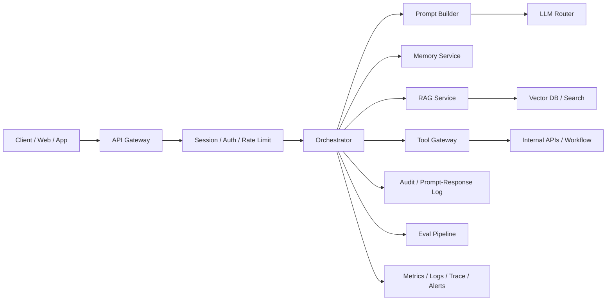

# AI 问答系统架构、监控与评估

## 本章目标

- 回答 AI 问答系统怎么搭、怎么监控、怎么评估、怎么记日志。
- 把“问答服务”升级成“可观测、可回放、可迭代”的系统。

## 关键问题

- AI Chat 系统的核心组件是什么？
- Agent 评估和 RAG 评估为什么不能混成一个指标？
- Prompt 和 Response 日志怎么记，才能既有用又合规？

## Q7：如何评估 Agent 的执行效果？

### 一句话回答

评估 Agent 不能只看最终回答是否“像对的”，还要看任务完成率、工具调用质量、过程效率、风险控制和业务结果。

### 详细展开

Agent 评估通常分三层：

1. `结果层`
  - 任务是否完成
  - 最终答案是否正确
  - 用户是否满意
2. `过程层`
  - 是否选对工具
  - 是否出现无效循环
  - 是否超预算
  - 是否按预期阶段流转
3. `业务层`
  - 工单解决率
  - 转人工率
  - 订单完成率
  - 人工审核通过率

### 落地要点

- 评估集要覆盖成功路径和失败路径。
- 除了最终答案，还要记录中间轨迹，便于分析是 planning 问题、tool selection 问题还是 grounding 问题。
- 对高风险 Agent，安全相关指标要单列，例如越权调用率、审批绕过率。

### 高频追问

- LLM-as-a-judge 能评 Agent 吗？
  - 可以做辅助，但最好和规则校验、人工标注、业务指标结合。

## Q17：如何设计一个 AI 问答系统架构？

### 一句话回答

设计 AI 问答系统时，核心思路是把“会话接入、上下文管理、知识检索、模型调用、工具能力、日志评估”拆成独立层。

### 详细展开

一个生产级 AI 问答系统通常至少有这些组件：

- `接入层`：API Gateway、鉴权、限流、会话识别
- `编排层`：路由、prompt 组装、模型选择、工具策略
- `记忆层`：短期 memory、长期 profile、摘要
- `知识层`：文档处理、检索、rerank、引用
- `模型层`：chat / embedding / rerank model
- `工具层`：实时业务系统、审批、工作流
- `治理层`：日志、审计、监控、评测、灰度

### 落地要点

- 不要让前端直接调模型供应商。
- 问答架构要同时区分：
  - 纯聊天问题
  - 需检索问题
  - 需工具问题
- 架构里最好预留 prompt 管理和离线评测位点，后续迭代会非常依赖。

### 高频追问

- 一上来要不要做多 Agent？
  - 通常不要。先做单编排器 + 检索 + 工具 + 记忆，复杂后再拆。

## Q19：AI 系统如何做监控？

### 一句话回答

AI 系统监控要同时覆盖传统服务指标和 AI 专属指标，至少要有 metrics、logs、traces、prompt/response 采样和评测回流。

### 详细展开

建议分四类监控：

1. `基础服务`
  - QPS
  - 错误率
  - 延迟
  - 线程池/连接池
2. `模型调用`
  - 请求数
  - token 用量
  - TTFT
  - 超时率
  - provider error
3. `检索与工具`
  - 检索耗时
  - 命中率
  - rerank 耗时
  - 工具成功率
4. `体验与质量`
  - 首答解决率
  - 转人工率
  - 幻觉率
  - 用户评分

### 落地要点

- 一个请求至少要有全链路 trace_id。
- 把 prompt 版本、模型名、knowledge version、tool set version 打进日志和 trace。
- 对异常高 token、异常长链路、异常重试做专门告警。

### 高频追问

- 只做日志不做 trace 行不行？
  - 不够。多阶段 AI 链路里，trace 对定位哪个环节慢、哪个环节错非常关键。

## Q35：AI Chat 系统的整体架构是什么？

### 一句话回答

AI Chat 系统整体上可以理解为 `前端会话层 + 后端编排层 + LLM / RAG / Tools 能力层 + 观测治理层`。

### 详细展开

和 Q17 的区别在于，Q35 更强调“整体分层”：

- `会话层`
  - 聊天窗口
  - 流式渲染
  - 会话切换
- `应用层`
  - prompt 管理
  - session 管理
  - memory
  - routing
- `AI 能力层`
  - chat model
  - embeddings
  - reranker
  - tools
- `数据与治理层`
  - knowledge base
  - audit
  - metrics
  - eval

### 落地要点

- Q17 回答“怎么设计”，Q35 回答“长什么样”，面试里要区分。
- AI Chat 不只是一个聊天接口，而是一套围绕上下文、流式输出、观测治理构建的系统。

### 高频追问

- AI Chat 和 AI 问答是不是同一个东西？
  - 不是。AI Chat 更偏交互框架，AI 问答更偏知识和回答正确性。

## Q41：AI 系统如何记录 Prompt 和 Response？

### 一句话回答

记录 Prompt 和 Response 的目标不是“把所有内容全量落盘”，而是在可追溯、可评测和合规之间取得平衡。

### 详细展开

建议按三层记录：

1. `请求元数据`
  - trace_id
  - session_id
  - user_id / tenant_id
  - model
  - prompt_version
  - tool_set_version
2. `输入输出摘要`
  - prompt hash
  - message count
  - token 统计
  - 结果摘要
3. `可回放内容`
  - 采样保存完整 prompt / response
  - 工具调用记录
  - 引用片段

### 落地要点

- 对敏感字段做脱敏、加密或字段级过滤。
- 最好把“完整可回放日志”和“可检索运营日志”分仓。
- 对流式输出要同时记录：
  - 首 token 时间
  - 完成时间
  - 终止原因
  - 中途取消原因

### 高频追问

- 为什么不能全量存全部 prompt / response？
  - 成本、隐私、合规和数据泄露风险都很高，而且很多场景没有必要。
